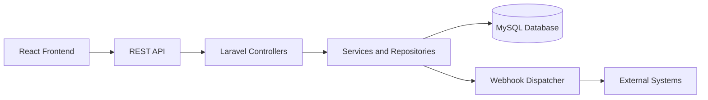
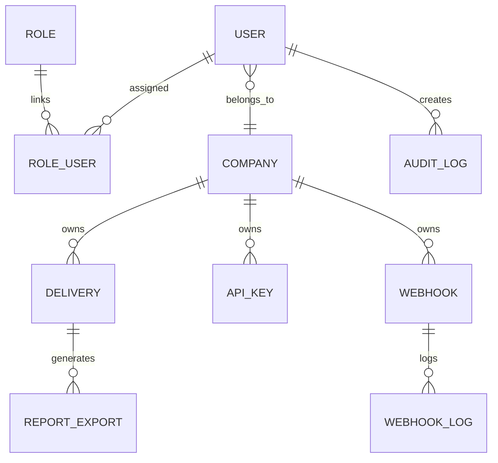
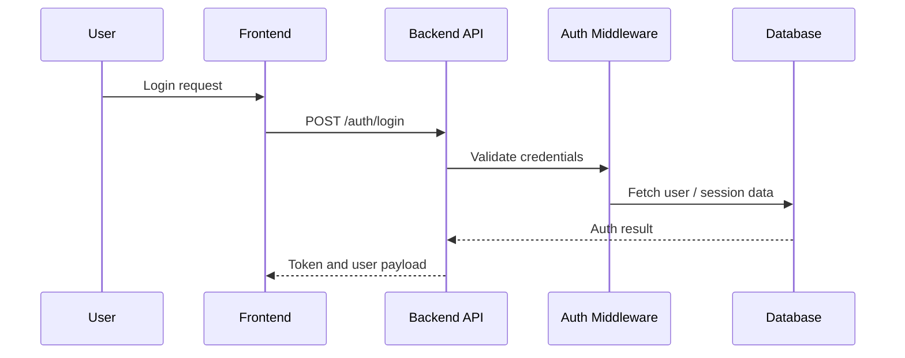
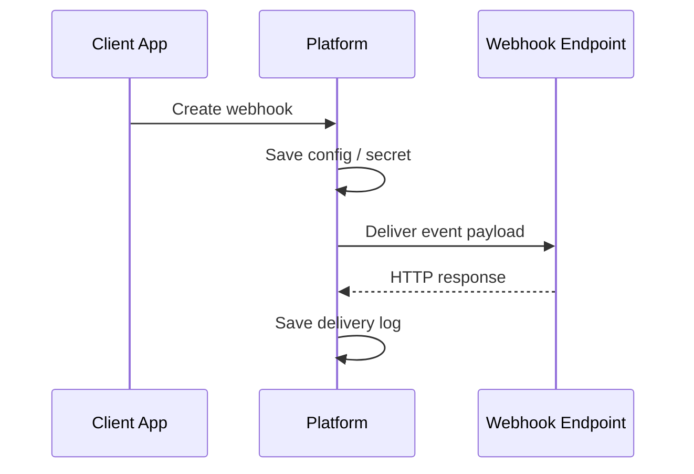

# Software Design Description

## 1. System architecture

The platform uses a layered architecture with a Laravel backend and a React frontend. The backend exposes authenticated REST endpoints and stores operational data in a MySQL database. The frontend consumes those endpoints via the Vite-based UI shell.



## 2. Frontend architecture

The frontend is organized around route-based screens, context providers, and modular components. Authentication state and UI theme are handled through dedicated providers, while feature modules are grouped by responsibility.

## 3. Backend architecture

The backend is a Laravel application organized by feature domains:

- Authentication and session management
- Company lifecycle management
- Client delivery flows
- Reports and audit logging
- API key and webhook management
- Access control and permissions

## 4. Database architecture

The database includes tables for users, companies, roles, permissions, deliveries, customers, API keys, webhooks, logs, report exports, and audit entries. Relationships are designed around company ownership and access scopes.



## 5. Authentication architecture

Authentication relies on Laravel Sanctum and custom user session flows. The system supports login, registration, verification, recovery, and MFA challenge handling. Security-sensitive routes are protected behind middleware and permission checks.



## 6. Authorization architecture

The permission model separates platform-level and company-scoped roles. Middleware ensures that sensitive endpoints are only available to validated users with the required permission.

## 7. API architecture

The application exposes a versioned REST API under /api/v1. Public and authenticated routes are separated to support egress operations and internal administrative workflows. Controllers are organized by domain and action.

```mermaid
flowchart TD
A[Client Request] --> B[/api/v1]
B --> C[Public] 
B --> D[Authenticated]
D --> E[Admin Routes]
D --> F[Client Routes]
```

## 8. Component architecture

The frontend is composed of reusable UI blocks, route layouts, feature modules, and global providers for theming and toast notifications. This keeps screens modular, adaptable, and easier to scale.

## 9. Service architecture

Business behaviors are separated into service and repository-oriented patterns so controllers stay focused on request handling and validation. This supports maintainability for reporting, integrations, and company workflows.

## 10. Webhook architecture

Webhook endpoints are created per company or app context and include event metadata, secret handling, test dispatch, and delivery logging. The platform tracks delivery attempts and stores webhook logs for troubleshooting.



## 11. Integration architecture

The application supports external integration patterns using API keys, webhook endpoints, and outward-facing reporting or verification features.

## 12. Security architecture

Security responsibilities include environment-based secret management, role-based route guarding, session validation, email verification, MFA support, and permission enforcement. Sensitive local files are ignored by version control.

## 13. Deployment architecture

Deployment patterns include Laravel PHP app execution, frontend build output generation, and infrastructure examples for Apache and Nginx. Configuration is designed to be environment-specific.

## 14. Error handling

The platform uses Laravel exception handling, validation flows, and targeted audit logging to capture operational errors and security-sensitive events.

## 15. Logging

Audit, request, and webhook logs are persisted to support troubleshooting and compliance tracking.

## 16. Data flow

- User actions are initiated in the frontend.
- The backend validates identity and permissions.
- Business logic persists the change to MySQL.
- Event or report data is emitted as needed.
- Logs and exports are captured for review.

## 17. Design decisions

- Laravel-first backend to align with enterprise API patterns.
- React + Vite frontend to keep the UI modular and fast.
- Versioned REST endpoints to support evolution.
- Permission-based access to avoid unsafe broad authorization.
- Secret management via environment configuration to protect credentials.
